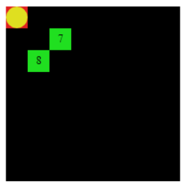
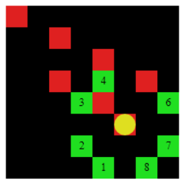

  Esto es un juego de una persona, hay un tablero donde se mueve una ficha en forma de “L”, como el caballo en el juego de Ajedrez. 
Esta ficha no puede repetir casilla durante el juego. El objetivo es visitar todas las casillas del tablero. 

# Juego sencillo con CodeWorld y Haskell

## Puedes ejecutar este código usando CodeWorld en tu Navegador:

* https://code.world/haskell#

Para realizar un movimiento de la ficha, presiona el número de opción en tu teclado.

